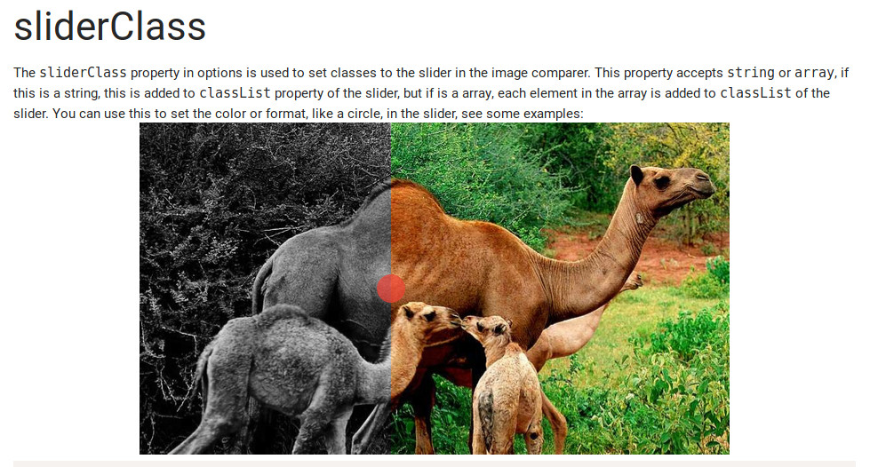

# Materialize Image Comparer

This component takes the name of materialize, but it's not a material design component. This name of materialize is because i create this (based on MetroUI component) for my personal use in my materialize page, that i'm developing. The component visual is see in the image below.



## Getting Started

### Add reference for JavaScript and CSS

Includes the image comparer css and javascript (materialize is not required for the component).

```html
<!DOCTYPE html>
<html lang="en">
<head>
    <meta charset="UTF-8">
    <meta name="viewport" content="width=device-width, initial-scale=1.0">
    <meta http-equiv="X-UA-Compatible" content="ie=edge">
    <link rel="stylesheet" href="https://cdn.jsdelivr.net/gh/EduardoJM/Materialize-Image-Comparer@1.0.2/dist/css/image-comparer.min.css" />
    <title>Document</title>
</head>
<body>

    
    <script src="https://cdn.jsdelivr.net/gh/EduardoJM/Materialize-Image-Comparer@1.0.2/dist/js/image-comparer.min.js"></script>
</body>
</html>
```

### Add the Component Markup

```html
<div class="image-compare">
    
    
</div>
```

### Initialize via JavaScript

```javascript
var el = document.querySelector('.image-compare');
var comp = new ImageCompare(el, options);
```

For more informations see the [documentation](https://eduardojm.github.io/Materialize-Image-Comparer/) (the documentation is in development for now, then sorry for bad explained things for now).

## Building

In the `./dist/` folder has a builded distribution of the javascript and the css. The source javascript and sass files is disponible in the `./src/` folder and can be builded using the gulp.

### Clone the Repository

```bash
git clone https://github.com/EduardoJM/Materialize-Image-Comparer.git
cd Materialize-Image-Comparer
```

### Install Dependencies

```bash
npm install 
```

### Run Gulp Task(s)

To build the sass and the javascript files, run the tasks:

```bash
gulp sass
gulp js
```

If you want to watch for javascript source files modification, use the task:

```bash
gulp watchJS
```

And if you want to watch for sass source files modification, use the task:

```bash
gulp watchSASS
```